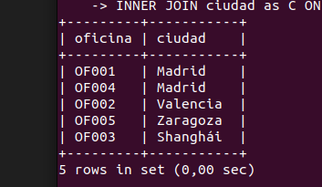
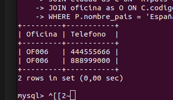
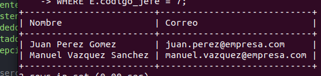
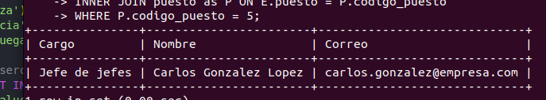
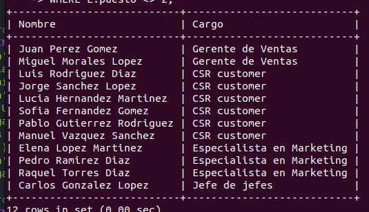
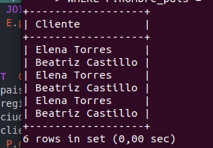
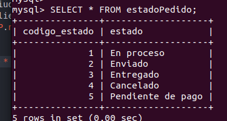
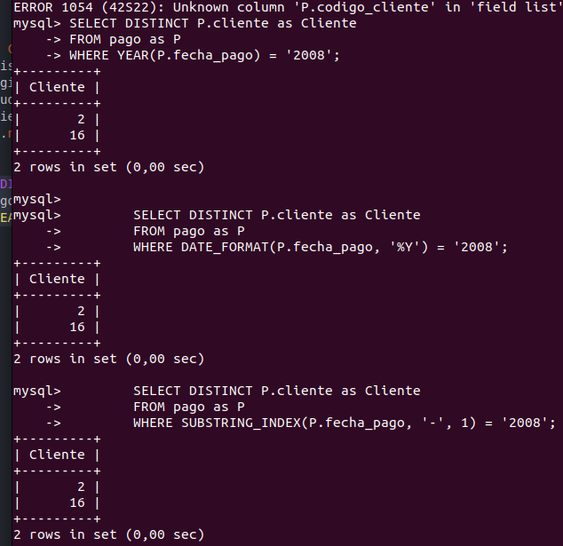
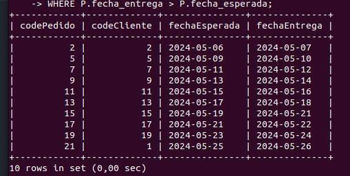
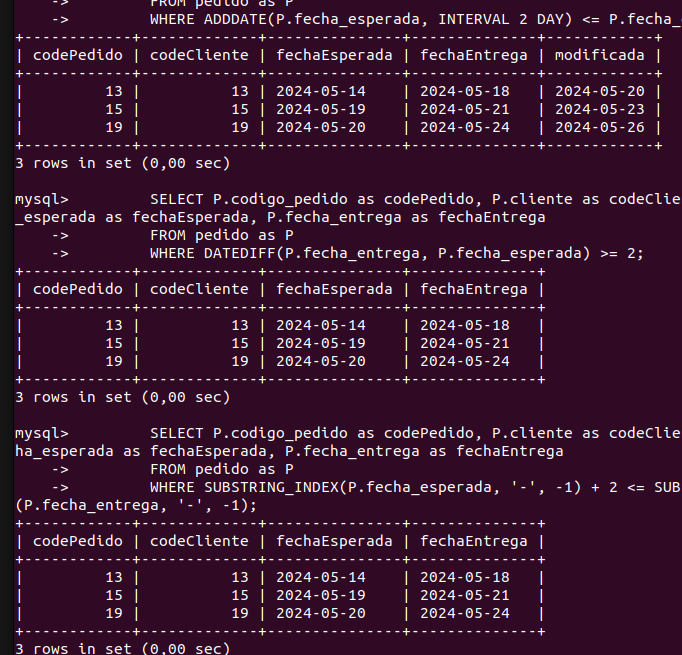

# DbGarden Taller
Crear repositorio con la solucion de cada requerimiento de base de datos. El repositorio debe contener Readme con el enumciado de la consulta, la solucion y el resultado obtenido.  Asegurese que todas las consultas arrojen resultados.
## CONSULTAS SOBRE UNA TABLA

1. Devuelve un listado con el código de oficina y la ciudad donde hay oficinas.
    ```SQL
        SELECT O.codigo_oficina as oficina, C.nombre_ciudad as ciudad 
        FROM oficina AS O
        INNER JOIN ciudad as C ON C.codigo_ciudad = O.ciudad;
    ```   
    

1. Devuelve un listado con la ciudad y el teléfono de las oficinas de España.
    ```SQL
        SELECT
            T.oficina as Oficina ,T.telefono as Telefono
        FROM
            telefono AS T
        WHERE
            T.oficina IN (SELECT  DISTINCT O.codigo_oficina
        FROM pais as P
        JOIN region as R ON P.codigo_pais = R.pais
        JOIN ciudad as C ON  R.pais = C.region
        JOIN oficina as O ON C.codigo_ciudad = O.ciudad
        WHERE P.nombre_pais = 'España');
    ```  
    

1. Devuelve un listado con el nombre, apellidos y email de los empleados cuyo
jefe tiene un código de jefe igual a 7.
    ```SQL 
        SELECT  CONCAT(E.nombre, ' ', E.apellido1 , ' ', E.apellido2) AS Nombre, E.email as Correo
        FROM empleado as E
        WHERE E.codigo_jefe = 7;
    ```
    

1. Devuelve el nombre del puesto, nombre, apellidos y email del jefe de la
empresa.
    ```SQL
        SELECT P.puesto as Cargo, CONCAT(E.nombre, ' ', E.apellido1 , ' ', E.apellido2) AS Nombre, E.email as Correo
        FROM empleado as E
        INNER JOIN puesto as P ON E.puesto = P.codigo_puesto
        WHERE P.codigo_puesto = 5; 
    ```
    

1. Devuelve un listado con el nombre, apellidos y puesto de aquellos
empleados que no sean representantes de ventas.
    ```SQL
        SELECT CONCAT(E.nombre, ' ', E.apellido1 , ' ', E.apellido2) AS Nombre, P.puesto as Cargo
        FROM empleado as E
        INNER JOIN puesto as P ON E.puesto = P.codigo_puesto
        WHERE E.puesto <> 2;
    ```
    

1. Devuelve un listado con el nombre de los todos los clientes españoles.
    ```SQL
        SELECT  CC.nombre_cliente as Cliente
        FROM pais as P
        JOIN region as R ON P.codigo_pais = R.pais
        JOIN ciudad as C ON  R.pais = C.region
        JOIN cliente as CC ON C.codigo_ciudad = CC.ciudad
        WHERE P.nombre_pais = 'España';
    ```
    

1. Devuelve un listado con los distintos estados por los que puede pasar un
pedido.
    ```SQL
        SELECT * 
        FROM estadoPedido;
    ```
    

1. Devuelve un listado con el código de cliente de aquellos clientes que
realizaron algún pago en 2008. Tenga en cuenta que deberá eliminar
aquellos códigos de cliente que aparezcan repetidos. Resuelva la consulta:
    1. Utilizando la función YEAR de MySQL.
        ```SQL
        SELECT DISTINCT P.cliente as Cliente
        FROM pago as P
        WHERE YEAR(P.fecha_pago) = '2008';
        ```
    1. Utilizando la función DATE_FORMAT de MySQL.
        ```SQL
            SELECT DISTINCT P.cliente as Cliente
            FROM pago as P
            WHERE DATE_FORMAT(P.fecha_pago, '%Y') = '2008';
        ```
    1. Sin utilizar ninguna de las funciones anteriores.
        ```SQL
            SELECT DISTINCT P.cliente as Cliente
            FROM pago as P
            WHERE SUBSTRING_INDEX(P.fecha_pago, '-', 1) = '2008';
        ```
        

1. Devuelve un listado con el código de pedido, código de cliente, fecha
esperada y fecha de entrega de los pedidos que no han sido entregados a
tiempo.
    ```SQL
        SELECT P.codigo_pedido as codePedido, P.cliente as codeCliente, P.fecha_esperada as fechaEsperada, P.fecha_entrega as fechaEntrega
        FROM pedido as P
        WHERE P.fecha_entrega > P.fecha_esperada;
    ```
    

1. Devuelve un listado con el código de pedido, código de cliente, fecha
esperada y fecha de entrega de los pedidos cuya fecha de entrega ha sido al
menos dos días antes de la fecha esperada.
    1. Utilizando la función ADDDATE de MySQL.
    ```SQL
        SELECT P.codigo_pedido as codePedido, P.cliente as codeCliente, P.  fecha_esperada as fechaEsperada, P.fecha_entrega as fechaEntrega, ADDDATE(P.fecha_entrega, INTERVAL 2 DAY) as modificada
        FROM pedido as P
        WHERE ADDDATE(P.fecha_esperada, INTERVAL 2 DAY) <= P.fecha_entrega;
    ```
    2. Utilizando la función DATEDIFF de MySQL.
    ```SQL
        SELECT P.codigo_pedido as codePedido, P.cliente as codeCliente, P.fecha_esperada as fechaEsperada, P.fecha_entrega as fechaEntrega
        FROM pedido as P
        WHERE DATEDIFF(P.fecha_entrega, P.fecha_esperada) >= 2;
    ```
    3. Utilizando la función DATEDIFF de MySQL.
    ```SQL
        SELECT P.codigo_pedido as codePedido, P.cliente as codeCliente, P.  fecha_esperada as fechaEsperada, P.fecha_entrega as fechaEntrega
        FROM pedido as P
        WHERE SUBSTRING_INDEX(P.fecha_esperada, '-', -1) + 2 <= SUBSTRING_INDEX(P.fecha_entrega, '-', -1);
    ```
    

1. Devuelve un listado de todos los pedidos que fueron rechazados en 2009.
    ```SQL
        SELECT P.codigo_pedido as Pedido, P.fecha_pedido as 'Fecha pedido', EP.estado as Estado
        FROM pedido as P
        INNER JOIN estadoPedido AS EP ON P.estado = EP.codigo_estado
        WHERE EP.estado = 'Rechazado' AND SUBSTRING_INDEX(P.fecha_pedido, '-', 1) = '2009';
    ```
    

